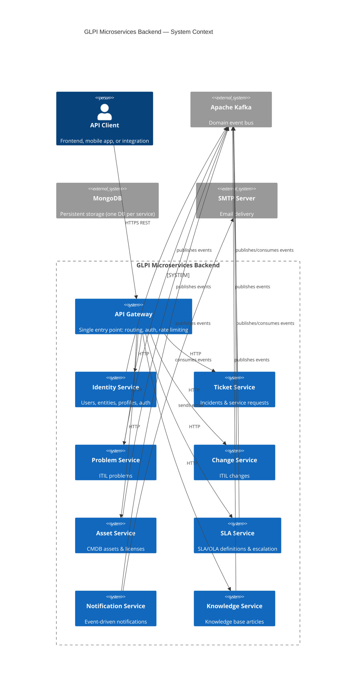

# Design Document — GLPI Microservices Backend

## Overview

This document describes the technical design for rebuilding the GLPI ITSM backend as a cloud-native microservices system. The legacy GLPI v12.0.0 PHP monolith (located in `.legacy/`) serves as the domain behavior reference. The new system exposes the same ITIL operations through REST APIs, built with Java 21, Spring Boot 3.x, MongoDB, and Apache Kafka.

### Design Goals

- **Domain fidelity**: Preserve all ITIL business rules from the legacy system.
- **Loose coupling**: Each bounded context is an independent deployable service communicating via Kafka domain events.
- **Hexagonal architecture**: Business logic is isolated from infrastructure through Ports & Adapters.
- **DDD alignment**: Each service owns its aggregate root, repository, and domain events.
- **Operational simplicity**: Full stack starts with `docker compose up`.

### Technology Stack

| Concern | Technology |
|---|---|
| Language | Java 21 (virtual threads via Project Loom) |
| Framework | Spring Boot 3.x |
| Database | MongoDB 7.x (one database per service) |
| Messaging | Apache Kafka 3.x |
| API Gateway | Spring Cloud Gateway |
| Auth | JWT RS256 (Spring Security + JJWT) |
| API Docs | SpringDoc OpenAPI 3.0 |
| Build | Maven (multi-module) |
| Containerization | Docker + Docker Compose |
| Testing (unit) | JUnit 5 + Mockito |
| Testing (property) | jqwik |

---

## Architecture

### System Context



### Hexagonal Architecture per Service

Every microservice follows the same internal structure:

```
src/main/java/com/glpi/{service}/
├── domain/
│   ├── model/          # Aggregates, entities, value objects
│   ├── port/
│   │   ├── in/         # Use case interfaces (driving ports)
│   │   └── out/        # Repository & event interfaces (driven ports)
│   └── service/        # Domain services implementing use cases
├── application/
│   └── usecase/        # Application-layer orchestration
├── adapter/
│   ├── in/
│   │   └── rest/       # REST controllers (driving adapter)
│   └── out/
│       ├── persistence/ # MongoDB repositories (driven adapter)
│       └── messaging/   # Kafka producers (driven adapter)
└── config/             # Spring configuration, beans
```

### Service Port Map (Docker Compose)

| Service | Internal Port | Host Port |
|---|---|---|
| API Gateway | 8080 | 8080 |
| Identity Service | 8081 | 8081 |
| Ticket Service | 8082 | 8082 |
| Problem Service | 8083 | 8083 |
| Change Service | 8084 | 8084 |
| Asset Service | 8085 | 8085 |
| SLA Service | 8086 | 8086 |
| Notification Service | 8087 | 8087 |
| Knowledge Service | 8088 | 8088 |
| MongoDB | 27017 | 27017 |
| Kafka | 9092 | 9092 |
| Zookeeper | 2181 | 2181 |

### Kafka Topic Map

| Topic | Producers | Consumers |
|---|---|---|
| `identity.users` | Identity | Notification, Ticket, Asset |
| `identity.entities` | Identity | All services |
| `identity.profiles` | Identity | API Gateway |
| `tickets.events` | Ticket | Notification, SLA, Problem, Change |
| `problems.events` | Problem | Notification, Change |
| `changes.events` | Change | Notification |
| `assets.events` | Asset | Notification, Ticket |
| `sla.events` | SLA | Notification, Ticket |
| `notifications.outbound` | Notification | — |
| `knowledge.events` | Knowledge | Notification |
| `*.dlq` | All (DLQ router) | Ops/alerting |

---

## Components and Interfaces

### API Gateway

**Responsibilities**: JWT validation, rate limiting, request routing, CORS, App-Token validation, health aggregation, OpenAPI aggregation.

**Key Beans**:
- `JwtAuthenticationFilter` — validates RS256 JWT, extracts claims, forwards as headers
- `RateLimitingFilter` — token bucket per user ID (Redis or in-memory for dev)
- `RouteConfiguration` — Spring Cloud Gateway route definitions
- `HealthAggregator` — polls `/actuator/health` on all downstream services

**Forwarded Headers** (added by gateway after JWT validation):
```
X-User-Id: {userId}
X-Entity-Id: {entityId}
X-Profile-Id: {profileId}
X-User-Rights: {base64-encoded JSON rights map}
```

### Identity Service

**Aggregates**: `User`, `Entity`, `Profile`, `Group`

**Use Cases (Driving Ports)**:
```java
interface CreateUserUseCase { UserResponse createUser(CreateUserCommand cmd); }
interface AuthenticateUserUseCase { AuthResponse authenticate(AuthCommand cmd); }
interface RefreshTokenUseCase { AuthResponse refresh(RefreshTokenCommand cmd); }
interface ManageEntityUseCase { EntityResponse createEntity(CreateEntityCommand cmd); }
interface AssignProfileUseCase { void assignProfile(AssignProfileCommand cmd); }
interface ImpersonateUserUseCase { ImpersonationToken impersonate(ImpersonateCommand cmd); }
```

**Driven Ports**:
```java
interface UserRepository { Optional<User> findByUsername(String username); User save(User user); }
interface EntityRepository { Optional<Entity> findById(String id); List<Entity> findChildren(String parentId); }
interface ProfileRepository { Optional<Profile> findById(String id); }
interface TokenBlocklistPort { void block(String jti, Duration ttl); boolean isBlocked(String jti); }
interface EventPublisherPort { void publish(DomainEvent event); }
interface PasswordHistoryPort { List<String> getLastN(String userId, int n); void record(String userId, String hash); }
```

### Ticket Service

**Aggregates**: `Ticket` (contains embedded `Actor[]`, `Followup[]`, `Task[]`, `Solution`, `SlaContext`)

**Use Cases**:
```java
interface CreateTicketUseCase { TicketResponse createTicket(CreateTicketCommand cmd); }
interface UpdateTicketUseCase { TicketResponse updateTicket(UpdateTicketCommand cmd); }
interface AddFollowupUseCase { FollowupResponse addFollowup(AddFollowupCommand cmd); }
interface AddSolutionUseCase { TicketResponse addSolution(AddSolutionCommand cmd); }
interface RequestValidationUseCase { ValidationResponse requestValidation(RequestValidationCommand cmd); }
interface ComputePriorityUseCase { int computePriority(int urgency, int impact, String entityId); }
```

**Domain Services**:
- `PriorityMatrixService` — resolves entity-specific matrix, computes priority
- `SlaDeadlineService` — delegates to SLA Service via HTTP for deadline computation
- `StatusTransitionService` — enforces allowed transitions per profile matrix

### SLA Service

**Aggregates**: `Sla`, `Ola`, `Calendar`, `SlaLevel`

**Key Domain Service**:
```java
interface DeadlineComputationPort {
    Instant computeDeadline(Instant start, long durationSeconds, String calendarId);
    long computeElapsedBusinessSeconds(Instant start, Instant end, String calendarId);
}
```

**Escalation Scheduler**: Spring `@Scheduled` task running every 5 minutes, queries active tickets via Ticket Service HTTP client, evaluates SLA levels, publishes `SlaEscalationTriggered` events.

### Notification Service

**Aggregates**: `NotificationTemplate`, `QueuedNotification`

**Kafka Consumer Groups**:
- `notification-service` — consumes from `tickets.events`, `problems.events`, `changes.events`, `sla.events`, `knowledge.events`

**Retry Strategy**: Spring Retry with exponential backoff — delays: 1s, 4s, 16s. After 3 failures, message routed to `notifications.outbound.dlq`.

### Knowledge Service

**Aggregates**: `KnowbaseItem`, `KnowbaseItemCategory`

**Visibility Resolution**:
```java
interface VisibilityResolverPort {
    boolean isVisibleTo(KnowbaseItem article, UserContext user);
    List<KnowbaseItem> filterVisible(List<KnowbaseItem> articles, UserContext user);
}
```

---

## Data Models

### Domain Event Envelope

All Kafka messages share this envelope:

```java
record DomainEventEnvelope(
    String eventId,        // UUID v4
    String eventType,      // e.g. "TicketCreated"
    String aggregateId,    // e.g. ticket ID
    String aggregateType,  // e.g. "Ticket"
    Instant occurredAt,    // ISO 8601 UTC
    int version,           // schema version, starts at 1
    Object payload         // event-specific JSON object
) {}
```

### User Document (Identity Service — `users` collection)

```json
{
  "_id": "uuid",
  "username": "string",
  "passwordHash": "bcrypt-hash",
  "authType": 1,
  "authSourceId": null,
  "emails": [{"email": "string", "isDefault": true}],
  "isActive": true,
  "isDeleted": false,
  "entityId": "uuid",
  "profileId": "uuid",
  "language": "en_US",
  "personalToken": "aes256-encrypted",
  "apiToken": "aes256-encrypted",
  "totpSecret": "aes256-encrypted",
  "twoFactorEnabled": false,
  "passwordHistory": ["hash1", "hash2"],
  "failedLoginAttempts": 0,
  "lockedUntil": null,
  "createdAt": "ISO8601",
  "updatedAt": "ISO8601"
}
```

### Entity Document (Identity Service — `entities` collection)

```json
{
  "_id": "uuid",
  "name": "string",
  "parentId": "uuid-or-null",
  "level": 1,
  "completeName": "Root Entity > Child",
  "config": {
    "defaultTicketType": -2,
    "autoAssignMode": -2,
    "autoCloseDelay": -2,
    "calendarId": -2,
    "satisfactionSurveyEnabled": -2,
    "notificationSenderEmail": null
  },
  "createdAt": "ISO8601",
  "updatedAt": "ISO8601"
}
```

### Profile Document (Identity Service — `profiles` collection)

```json
{
  "_id": "uuid",
  "name": "string",
  "interface": "central",
  "isDefault": false,
  "twoFactorEnforced": false,
  "rights": {
    "ticket": 31,
    "problem": 31,
    "change": 31,
    "profile": 6,
    "user": 31
  },
  "ticketStatusMatrix": {"allowed": [[1,2],[2,3],[3,4],[4,2],[5,6]]},
  "createdAt": "ISO8601",
  "updatedAt": "ISO8601"
}
```

### Ticket Document (Ticket Service — `tickets` collection)

```json
{
  "_id": "uuid",
  "type": 1,
  "status": 1,
  "title": "string",
  "content": "rich-text",
  "entityId": "uuid",
  "priority": 3,
  "urgency": 3,
  "impact": 3,
  "categoryId": "uuid",
  "isDeleted": false,
  "actors": [
    {"actorType": 1, "actorKind": "user", "actorId": "uuid", "useNotification": true}
  ],
  "followups": [
    {"id": "uuid", "content": "string", "authorId": "uuid", "isPrivate": false, "source": "web", "createdAt": "ISO8601"}
  ],
  "tasks": [
    {"id": "uuid", "content": "string", "assignedUserId": "uuid", "status": 1, "isPrivate": false, "plannedStart": null, "plannedEnd": null, "duration": 0, "createdAt": "ISO8601"}
  ],
  "solution": null,
  "validations": [],
  "sla": {
    "slaId": "uuid",
    "ttoDeadline": "ISO8601",
    "ttrDeadline": "ISO8601",
    "waitingDuration": 0,
    "waitingStart": null,
    "olaId": "uuid",
    "internalTtoDeadline": "ISO8601",
    "internalTtrDeadline": "ISO8601"
  },
  "priorityManualOverride": false,
  "createdAt": "ISO8601",
  "updatedAt": "ISO8601",
  "solvedAt": null,
  "closedAt": null,
  "takeIntoAccountDelay": null
}
```

### Problem Document (Problem Service — `problems` collection)

```json
{
  "_id": "uuid",
  "status": 1,
  "title": "string",
  "content": "rich-text",
  "entityId": "uuid",
  "priority": 3,
  "urgency": 3,
  "impact": 3,
  "actors": [],
  "linkedTicketIds": [],
  "linkedAssets": [{"assetType": "Computer", "assetId": "uuid"}],
  "impactContent": "string",
  "causeContent": "string",
  "symptomContent": "string",
  "followups": [],
  "tasks": [],
  "solution": null,
  "createdAt": "ISO8601",
  "updatedAt": "ISO8601",
  "solvedAt": null,
  "closedAt": null
}
```

### Change Document (Change Service — `changes` collection)

```json
{
  "_id": "uuid",
  "status": 1,
  "title": "string",
  "content": "rich-text",
  "entityId": "uuid",
  "priority": 3,
  "urgency": 3,
  "impact": 3,
  "actors": [],
  "planningDocuments": {
    "impactContent": "string",
    "controlListContent": "string",
    "rolloutPlanContent": "string",
    "backoutPlanContent": "string",
    "checklistContent": "string"
  },
  "validationSteps": [
    {"id": "uuid", "validatorId": "uuid", "validatorKind": "user", "status": 1, "comment": null, "order": 1}
  ],
  "linkedTicketIds": [],
  "linkedProblemIds": [],
  "linkedAssets": [],
  "followups": [],
  "tasks": [],
  "solution": null,
  "satisfactionSurvey": null,
  "createdAt": "ISO8601",
  "updatedAt": "ISO8601",
  "closedAt": null
}
```

### Asset Document (Asset Service — `assets` collection, polymorphic)

```json
{
  "_id": "uuid",
  "assetType": "Computer",
  "name": "string",
  "entityId": "uuid",
  "serial": "string",
  "otherSerial": "string",
  "stateId": "uuid",
  "locationId": "uuid",
  "userId": "uuid",
  "groupId": "uuid",
  "manufacturerId": "uuid",
  "modelId": "uuid",
  "isDeleted": false,
  "computerDetails": {
    "osInstallation": {"osId": "uuid", "osVersionId": "uuid", "servicePackId": "uuid"},
    "devices": [],
    "diskPartitions": [],
    "softwareInstallations": [],
    "virtualMachines": []
  },
  "networkPorts": [
    {"id": "uuid", "name": "string", "mac": "string", "ip": "string", "vlan": "string", "connectionType": "ethernet"}
  ],
  "infocom": {
    "purchaseDate": "ISO8601",
    "purchasePrice": 0.0,
    "warrantyExpiry": "ISO8601",
    "orderNumber": "string",
    "deliveryDate": "ISO8601",
    "depreciationRate": 0.0
  },
  "contractIds": [],
  "createdAt": "ISO8601",
  "updatedAt": "ISO8601"
}
```

### SLA Document (SLA Service — `slas` collection)

```json
{
  "_id": "uuid",
  "name": "string",
  "entityId": "uuid",
  "type": 1,
  "durationSeconds": 14400,
  "calendarId": "uuid",
  "levels": [
    {
      "id": "uuid",
      "name": "string",
      "executionDelaySeconds": -3600,
      "actions": [
        {"actionType": "send_notification", "parameters": {}},
        {"actionType": "reassign", "parameters": {"groupId": "uuid"}},
        {"actionType": "change_priority", "parameters": {"priority": 5}}
      ]
    }
  ],
  "createdAt": "ISO8601",
  "updatedAt": "ISO8601"
}
```

### Calendar Document (SLA Service — `calendars` collection)

```json
{
  "_id": "uuid",
  "name": "string",
  "entityId": "uuid",
  "isRecursive": true,
  "segments": [
    {"dayOfWeek": 1, "startTime": "08:00", "endTime": "20:00"},
    {"dayOfWeek": 2, "startTime": "08:00", "endTime": "20:00"}
  ],
  "holidays": [
    {"id": "uuid", "name": "New Year", "date": "2026-01-01", "isRecurring": true}
  ],
  "createdAt": "ISO8601",
  "updatedAt": "ISO8601"
}
```

### KnowbaseItem Document (Knowledge Service — `knowledge_articles` collection)

```json
{
  "_id": "uuid",
  "title": "string",
  "answer": "rich-text",
  "authorId": "uuid",
  "isFaq": false,
  "viewCount": 0,
  "visibility": {
    "userIds": [],
    "groupIds": [],
    "profileIds": [],
    "entityRules": [{"entityId": "uuid", "isRecursive": true}]
  },
  "categoryIds": [],
  "revisions": [
    {"id": "uuid", "content": "string", "authorId": "uuid", "createdAt": "ISO8601"}
  ],
  "linkedItems": [{"itemType": "Ticket", "itemId": "uuid"}],
  "comments": [],
  "beginDate": null,
  "endDate": null,
  "createdAt": "ISO8601",
  "updatedAt": "ISO8601"
}
```

### QueuedNotification Document (Notification Service — `queued_notifications` collection)

```json
{
  "_id": "uuid",
  "eventType": "ticket.created",
  "channel": "email",
  "recipientId": "uuid",
  "recipientAddress": "user@example.com",
  "subject": "string",
  "body": "html",
  "status": "PENDING",
  "attempts": 0,
  "lastAttemptAt": null,
  "deliveredAt": null,
  "errorMessage": null,
  "createdAt": "ISO8601"
}
```

### MongoDB Indexes

Each service must create the following indexes on startup:

**users**: `username` (unique), `entityId`, `isActive`, `isDeleted`
**entities**: `parentId`, `name+parentId` (unique compound)
**tickets**: `entityId`, `status`, `type`, `isDeleted`, `createdAt`, `actors.actorId`
**problems**: `entityId`, `status`, `linkedTicketIds`
**changes**: `entityId`, `status`, `linkedTicketIds`, `linkedProblemIds`
**assets**: `entityId`, `assetType`, `isDeleted`, `userId`, `groupId`
**slas**: `entityId`, `type`
**knowledge_articles**: `isFaq`, `entityId`, `beginDate`, `endDate`, text index on `title+answer`
**queued_notifications**: `status`, `recipientId`, `createdAt`


---

## Correctness Properties

*A property is a characteristic or behavior that should hold true across all valid executions of a system — essentially, a formal statement about what the system should do. Properties serve as the bridge between human-readable specifications and machine-verifiable correctness guarantees.*

Property-based testing (PBT) is applicable to this feature because the system contains numerous pure functions (priority matrix computation, SLA deadline calculation, JWT claim extraction, permission bitfield encoding), universal invariants (status transition rules, event envelope structure, soft-delete filtering), and round-trip operations (token issuance/validation, serialization, password hashing). The PBT library used is **jqwik** (Java).

### Property 1: User mandatory fields invariant

*For any* valid user creation request, the stored User document must contain all mandatory fields (username, passwordHash, emails, isActive, createdAt) with non-null values and correct types.

**Validates: Requirements 1.1, 22.1**

---

### Property 2: Duplicate username rejection

*For any* username that already exists in the system, a second user creation request with the same username and same authType/authSource must be rejected with HTTP 409.

**Validates: Requirements 1.2**

---

### Property 3: Deactivated user authentication rejection

*For any* user with `isActive=false`, every authentication attempt (password, API token, or TOTP) must return HTTP 401.

**Validates: Requirements 1.5**

---

### Property 4: API token uniqueness

*For any* set of N users, all N generated personal API tokens must be pairwise distinct.

**Validates: Requirements 1.6**

---

### Property 5: Password history enforcement

*For any* user who has set at least one password, attempting to set any of the last 5 used passwords must be rejected with HTTP 422.

**Validates: Requirements 1.10**

---

### Property 6: UserPurged event publication

*For any* user that is purged, a `UserPurged` domain event must be published to the `identity.users` Kafka topic containing the correct user ID and a non-null timestamp.

**Validates: Requirements 1.11**

---

### Property 7: Entity tree parent invariant

*For any* entity in the system (except the root entity with id=0), it must have exactly one non-null parentId that references an existing entity.

**Validates: Requirements 2.1**

---

### Property 8: Entity name uniqueness within parent

*For any* parent entity, attempting to create two child entities with the same name must reject the second request with HTTP 409.

**Validates: Requirements 2.2**

---

### Property 9: Entity deletion blocked when children exist

*For any* entity that has at least one child entity, a deletion request must return HTTP 409.

**Validates: Requirements 2.3**

---

### Property 10: CONFIG_PARENT inheritance resolution

*For any* entity hierarchy where a descendant has a configuration field set to CONFIG_PARENT (-2), resolving the effective value must return the nearest ancestor's non-inherited value, traversing upward until the root.

**Validates: Requirements 2.4, 2.7**

---

### Property 11: Recursive entity assignment covers all descendants

*For any* entity with N descendants, a recursive profile assignment must grant access to all N descendant entities.

**Validates: Requirements 2.5**

---

### Property 12: Permission bitfield round-trip

*For any* combination of permission bits (READ=1, UPDATE=2, CREATE=4, DELETE=8, PURGE=16) stored in a profile right, reading back the stored value must preserve all bit flags exactly.

**Validates: Requirements 3.2, 3.3**

---

### Property 13: JWT contains all required claims

*For any* successful user authentication, the returned JWT payload must contain all six required claims: `sub`, `entity_id`, `profile_id`, `rights`, `iat`, `exp`, each with the correct type and a non-null value.

**Validates: Requirements 4.7, 3.4**

---

### Property 14: Expired JWT rejection

*For any* JWT whose `exp` claim is in the past, presenting it to the API Gateway must return HTTP 401 with error code `TOKEN_EXPIRED`.

**Validates: Requirements 4.2**

---

### Property 15: Refresh token rotation

*For any* valid refresh token, using it once must produce a new JWT access token and a new refresh token, and the original refresh token must be invalidated (subsequent use returns HTTP 401).

**Validates: Requirements 4.3, 4.4**

---

### Property 16: Logout blocklists JWT

*For any* valid JWT, after the user logs out, presenting that same JWT to any protected endpoint must return HTTP 401.

**Validates: Requirements 4.6**

---

### Property 17: Ticket creation invariant

*For any* valid ticket creation request, the resulting ticket must have `status=INCOMING`, a non-null `createdAt` timestamp, a non-null `requesterId`, and a non-null `entityId`.

**Validates: Requirements 5.3**

---

### Property 18: Ticket assignment triggers status transition

*For any* ticket in `INCOMING` status, assigning a user or group must result in `status=ASSIGNED` with a non-null assignment timestamp recorded.

**Validates: Requirements 5.4**

---

### Property 19: Priority matrix computation

*For any* valid (urgency, impact) pair where both values are in [1..5], the computed priority must equal `priority_matrix[urgency][impact]` as defined in the entity's configured matrix.

**Validates: Requirements 5.8, 27.1, 27.2**

---

### Property 20: CHANGEPRIORITY right enforcement

*For any* user who does not hold the `CHANGEPRIORITY` right, attempting to directly set the priority field on a ticket must return HTTP 403.

**Validates: Requirements 5.9**

---

### Property 21: Ticket event publication on create/update

*For any* ticket creation or update operation, a `TicketCreated` or `TicketUpdated` domain event must be published to the `tickets.events` Kafka topic containing the full ticket snapshot.

**Validates: Requirements 5.10, 21.2**

---

### Property 22: Soft-deleted tickets excluded from search

*For any* ticket with `isDeleted=true`, it must not appear in any default collection query result (GET /tickets).

**Validates: Requirements 5.11**

---

### Property 23: Ticket reopen on followup by requester

*For any* ticket in `CLOSED` or `SOLVED` status, adding a followup authored by the requester must transition the ticket to `INCOMING` status and publish a `TicketReopened` event.

**Validates: Requirements 5.7**

---

### Property 24: Solution addition transitions ticket to SOLVED

*For any* ticket, adding an `ITILSolution` must transition the ticket status to `SOLVED` and publish a `TicketSolved` event to Kafka.

**Validates: Requirements 7.4, 5.5**

---

### Property 25: Validation request sets ticket to WAITING

*For any* ticket, requesting a validation must set the ticket status to `WAITING` and publish a `TicketValidationRequested` event.

**Validates: Requirements 8.2**

---

### Property 26: SLA deadline excludes non-business hours

*For any* SLA deadline computation with a given calendar, the computed deadline must not fall within non-business hours or on a holiday defined in that calendar.

**Validates: Requirements 14.7, 14.8, 9.1, 9.2**

---

### Property 27: SLA timer pause/resume preserves elapsed time

*For any* ticket that enters and exits `WAITING` status, the `slaWaitingDuration` field must equal the total elapsed wall-clock seconds spent in WAITING, and the SLA deadline must be extended by exactly that duration.

**Validates: Requirements 9.3, 9.4**

---

### Property 28: License overuse event publication

*For any* software license where the number of active installations exceeds the licensed seat count, a `LicenseOverused` event must be published to the `assets.events` Kafka topic.

**Validates: Requirements 13.4**

---

### Property 29: Notification retry with exponential backoff

*For any* notification delivery failure, the system must retry up to 3 times with delays of 1s, 4s, and 16s before marking the notification as `FAILED`.

**Validates: Requirements 16.6**

---

### Property 30: Notification skips users with notifications disabled

*For any* actor on a ticket/problem/change who has `useNotification=false` for their actor role, that actor must not appear in the resolved notification target list.

**Validates: Requirements 16.10**

---

### Property 31: Knowledge article visibility — anonymous users

*For any* anonymous request for a knowledge article, only articles where `isFaq=true` and the entity visibility includes the root entity must be returned.

**Validates: Requirements 17.4**

---

### Property 32: Knowledge article view counter increment

*For any* article view request, the `viewCount` field must be incremented by exactly 1 atomically.

**Validates: Requirements 17.9**

---

### Property 33: Rate limit enforcement

*For any* authenticated user who has made 1000 requests within a 60-second window, the 1001st request must return HTTP 429 with a `Retry-After` header.

**Validates: Requirements 18.4, 18.5**

---

### Property 34: HTTP status code contract

*For any* successful GET request, the response status must be 200. For any successful POST that creates a resource, the response status must be 201. For any successful DELETE, the response status must be 204.

**Validates: Requirements 19.2**

---

### Property 35: Pagination metadata correctness

*For any* paginated collection response, the `totalElements`, `totalPages`, `currentPage`, and `pageSize` fields must be mathematically consistent: `totalPages = ceil(totalElements / pageSize)`.

**Validates: Requirements 19.6, 19.7**

---

### Property 36: Domain event envelope completeness

*For any* domain event published to any Kafka topic, the envelope must contain all six required fields: `eventId` (UUID), `eventType` (non-empty string), `aggregateId` (non-empty string), `aggregateType` (non-empty string), `occurredAt` (valid ISO 8601 timestamp), `version` (positive integer).

**Validates: Requirements 21.2**

---

### Property 37: Invalid status transition rejection

*For any* status transition that is not permitted by the profile's transition matrix, the system must return HTTP 422 with error code `INVALID_STATUS_TRANSITION`.

**Validates: Requirements 26.6, 26.1, 26.2, 26.3, 26.4**

---

### Property 38: Priority recomputed on urgency/impact change

*For any* ticket where urgency or impact is updated and the priority has not been manually overridden, the priority must be automatically recomputed using the entity's priority matrix.

**Validates: Requirements 27.4**

---

### Property 39: Seeder idempotency

*For any* microservice seeder that is run when the target collection already contains data, no additional documents must be inserted (the collection size must remain unchanged).

**Validates: Requirements 29.12**

---

### Property 40: Password stored as bcrypt hash

*For any* user creation or password update, the stored `passwordHash` must be a valid bcrypt hash (cost factor ≥ 12) and must never equal the plaintext password.

**Validates: Requirements 24.1**

---

### Property 41: Account lockout after failed attempts

*For any* username, after 5 consecutive failed login attempts within 10 minutes, subsequent login attempts must return HTTP 401 and an `AccountLocked` event must be published to Kafka.

**Validates: Requirements 24.7**

---


---

## Error Handling

### Error Response Schema

All error responses use a consistent JSON structure:

```json
{
  "timestamp": "2026-01-01T12:00:00Z",
  "status": 422,
  "errorCode": "INVALID_STATUS_TRANSITION",
  "message": "Transition from CLOSED to SOLVED is not permitted",
  "details": [
    {"field": "status", "message": "Cannot transition from CLOSED to SOLVED without reopening first"}
  ],
  "traceId": "uuid"
}
```

### Error Code Registry

| Code | HTTP Status | Description |
|---|---|---|
| `DUPLICATE_USERNAME` | 409 | Username already exists for the given auth type |
| `ENTITY_HAS_CHILDREN` | 409 | Cannot delete entity with child entities |
| `DUPLICATE_ENTITY_NAME` | 409 | Entity name already exists under the same parent |
| `PASSWORD_COMPLEXITY_VIOLATION` | 422 | Password does not meet complexity policy |
| `PASSWORD_HISTORY_VIOLATION` | 422 | Password was used in the last 5 passwords |
| `INVALID_STATUS_TRANSITION` | 422 | Status transition not permitted by profile matrix |
| `SOLUTION_REQUIRED` | 422 | Ticket cannot be solved without an ITILSolution |
| `VALIDATION_PENDING` | 422 | Cannot close ticket with pending validations |
| `TOKEN_EXPIRED` | 401 | JWT access token has expired |
| `TOKEN_INVALID` | 401 | JWT signature is invalid or malformed |
| `TOKEN_REVOKED` | 401 | JWT has been revoked (logout blocklist) |
| `REFRESH_TOKEN_REUSE` | 401 | Refresh token replay detected; family invalidated |
| `ACCOUNT_LOCKED` | 401 | Account temporarily locked due to failed attempts |
| `ACCOUNT_INACTIVE` | 401 | User account is deactivated |
| `TOTP_REQUIRED` | 401 | 2FA TOTP code required but not provided |
| `TOTP_INVALID` | 401 | TOTP code is incorrect or expired |
| `INSUFFICIENT_RIGHTS` | 403 | User lacks the required permission bit |
| `RESOURCE_NOT_FOUND` | 404 | Requested resource does not exist |
| `RATE_LIMIT_EXCEEDED` | 429 | User has exceeded 1000 requests/minute |
| `LICENSE_OVERUSED` | 422 | Software installation exceeds licensed seat count |
| `BULK_LIMIT_EXCEEDED` | 422 | Bulk operation exceeds 100 items per batch |
| `VALIDATION_ERROR` | 422 | Request body failed schema validation |

### Exception Handling Strategy

Each service implements a global `@RestControllerAdvice` that:

1. Catches domain exceptions (e.g., `InvalidStatusTransitionException`, `DuplicateUsernameException`) and maps them to the appropriate HTTP status and error code.
2. Catches Spring validation exceptions (`MethodArgumentNotValidException`) and collects all field errors into the `details` array.
3. Catches `MongoWriteException` for duplicate key violations and maps to 409.
4. Catches all unhandled exceptions and returns HTTP 500 with a generic message, logging the full stack trace with the `traceId`.
5. Never exposes internal stack traces or sensitive data in error responses.

### Kafka Dead-Letter Queue

When a Kafka consumer fails to process a message after 3 retries:

1. The message is forwarded to `{topic}.dlq` with additional headers: `X-Original-Topic`, `X-Failure-Reason`, `X-Retry-Count`, `X-Failed-At`.
2. An alert event is published to `notifications.outbound` targeting the configured ops email.
3. The consumer continues processing subsequent messages (no blocking).


