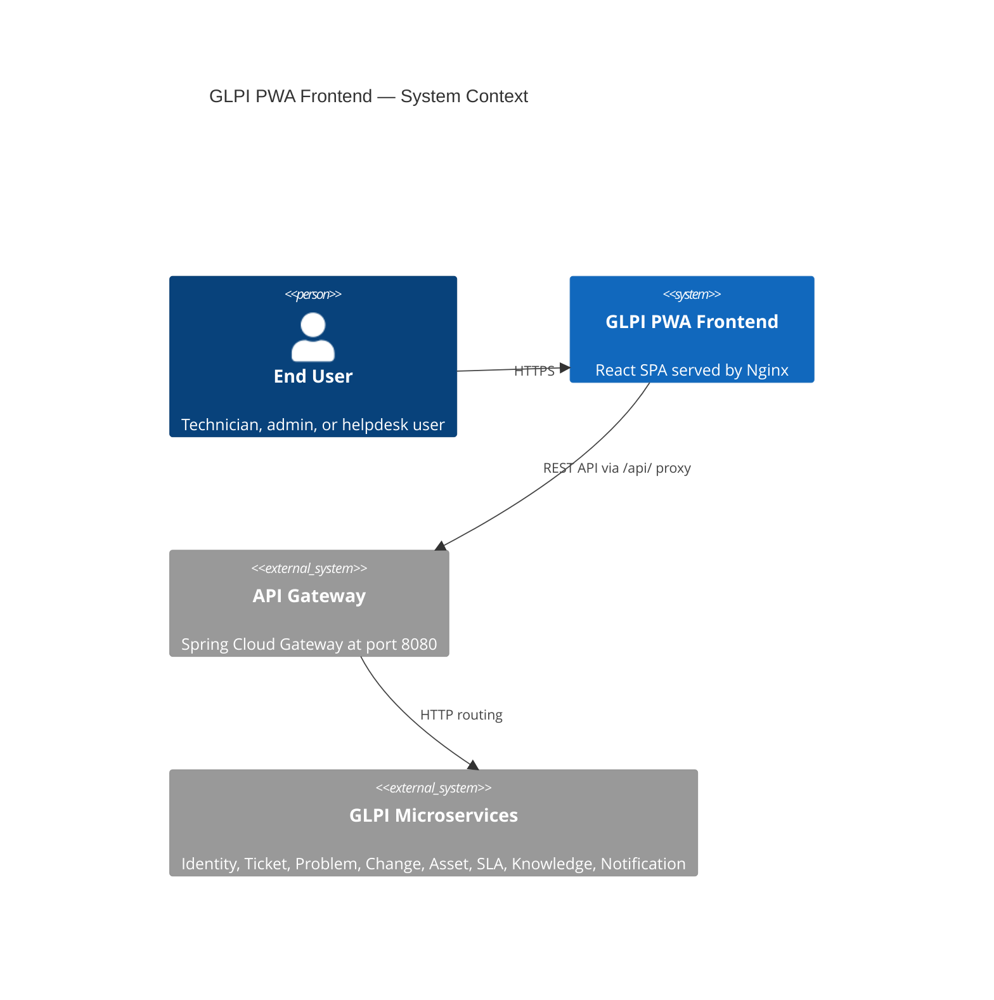
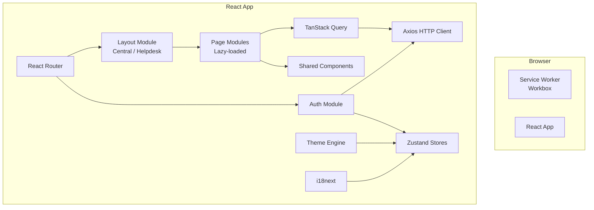
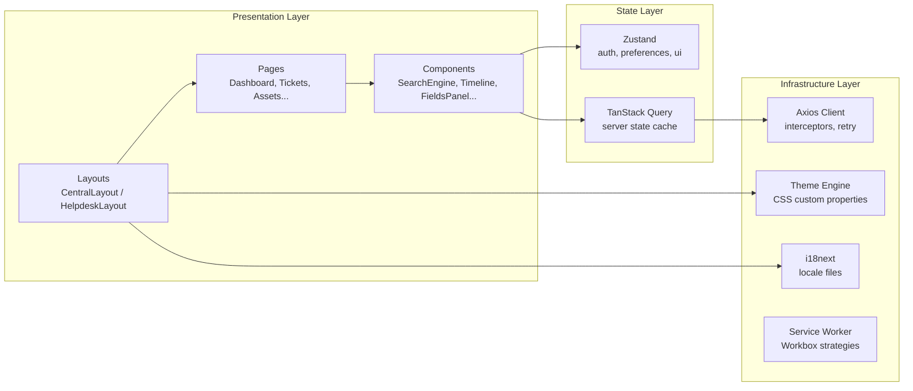
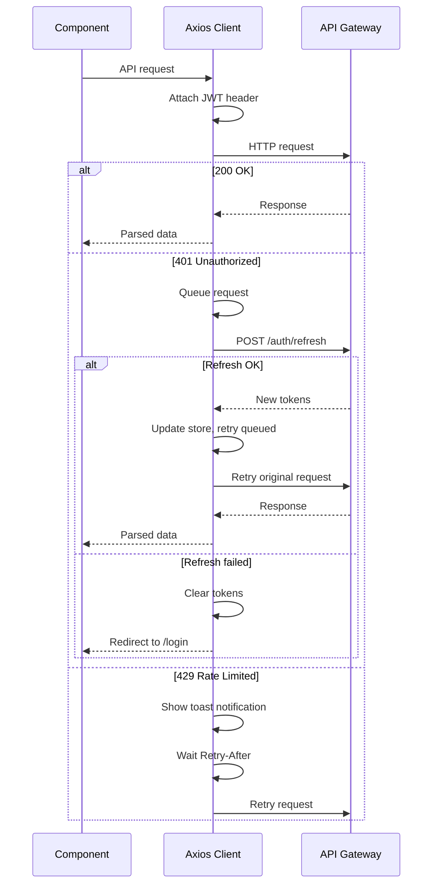

# Design Document — GLPI PWA Frontend MVP

## Overview

This document describes the technical design for the GLPI PWA Frontend MVP — a Progressive Web Application built with React that consumes the GLPI Microservices Backend (spec 2026.000001). The frontend replicates the visual design, navigation patterns, and ITIL object presentation of the legacy GLPI v12.0.0 application (located in `.legacy/` — read-only reference).

### Design Goals

- **Visual fidelity**: Replicate the legacy GLPI Tabler-based design system — sidebar colors, timeline entry colors, status badges, priority indicators, and palette switching.
- **Dual interface**: Support both Central (technician/admin sidebar layout) and Helpdesk (end-user simplified layout) interfaces, driven by the active profile's `interface` field.
- **API-first**: All data flows through the API Gateway at port 8080; the frontend has zero direct database access.
- **PWA capabilities**: Installable standalone app with service worker caching, offline shell, and update notifications.
- **Responsive**: Fluid layout from 320px mobile to 2560px ultra-wide, with breakpoint-driven layout shifts matching the legacy responsive behavior.
- **Accessible**: Semantic HTML5, ARIA labels, keyboard navigation, focus indicators, and 4.5:1 contrast ratio.
- **i18n-ready**: All strings externalized via react-i18next; MVP ships en-US only.

### Technology Stack

| Concern | Technology |
|---|---|
| Language | TypeScript 5.x |
| Framework | React 18.x |
| Build Tool | Vite 5.x |
| Routing | React Router 6.x |
| State Management | Zustand 4.x (global) + TanStack Query 5.x (server state) |
| HTTP Client | Axios 1.x (with interceptors) |
| Styling | CSS Modules + CSS Custom Properties (design tokens) |
| Rich Text Editor | TipTap 2.x |
| Charts | Recharts 2.x |
| i18n | react-i18next + i18next |
| Testing (unit) | Vitest + React Testing Library |
| Testing (property) | fast-check |
| PWA | Workbox 7.x (service worker) + vite-plugin-pwa |
| Containerization | Docker (multi-stage: Node build + Nginx Alpine) |

---

## Architecture

### System Context



### High-Level Module Architecture



### Application Layer Diagram



### Project Structure

```
frontend/
├── public/
│   ├── manifest.json
│   ├── favicon.ico
│   └── icons/                    # PWA icons (192x192, 512x512)
├── src/
│   ├── main.tsx                  # Entry point
│   ├── App.tsx                   # Root component with providers
│   ├── router.tsx                # Route definitions with lazy loading
│   ├── api/
│   │   ├── client.ts             # Axios instance with interceptors
│   │   ├── endpoints.ts          # API endpoint constants
│   │   └── types.ts              # API response/request types
│   ├── stores/
│   │   ├── authStore.ts          # JWT tokens, user context
│   │   ├── preferencesStore.ts   # Theme, locale, layout prefs
│   │   └── uiStore.ts            # Sidebar collapsed, modals
│   ├── hooks/
│   │   ├── useTickets.ts         # TanStack Query hooks for tickets
│   │   ├── useProblems.ts        # TanStack Query hooks for problems
│   │   ├── useChanges.ts         # TanStack Query hooks for changes
│   │   ├── useAssets.ts          # TanStack Query hooks for assets
│   │   ├── useKnowledge.ts       # TanStack Query hooks for KB
│   │   ├── useAuth.ts            # Auth operations hook
│   │   ├── useSearch.ts          # Global search hook
│   │   └── useDashboard.ts       # Dashboard data hook
│   ├── layouts/
│   │   ├── CentralLayout.tsx     # Sidebar + TopBar + content
│   │   ├── HelpdeskLayout.tsx    # TopNav + content
│   │   └── AuthLayout.tsx        # Login page layout
│   ├── components/
│   │   ├── common/
│   │   │   ├── SearchEngine.tsx  # Configurable data table
│   │   │   ├── Pagination.tsx    # Page controls
│   │   │   ├── StatusBadge.tsx   # Colored status indicator
│   │   │   ├── PriorityBadge.tsx # Colored priority indicator
│   │   │   ├── ActorBadge.tsx    # User avatar/initials badge
│   │   │   ├── Toast.tsx         # Notification toast
│   │   │   ├── ErrorBoundary.tsx # Catch-all error UI
│   │   │   ├── LoadingSkeleton.tsx
│   │   │   └── RichTextEditor.tsx # TipTap wrapper
│   │   ├── navigation/
│   │   │   ├── Sidebar.tsx       # Vertical nav (Central)
│   │   │   ├── TopBar.tsx        # Breadcrumbs + search + user menu
│   │   │   ├── GlobalSearch.tsx  # Search dropdown
│   │   │   ├── UserMenu.tsx      # Profile/entity switcher
│   │   │   └── Breadcrumbs.tsx
│   │   ├── itil/
│   │   │   ├── Timeline.tsx      # Chronological entry list
│   │   │   ├── TimelineEntry.tsx # Single timeline item
│   │   │   ├── FieldsPanel.tsx   # Right-side metadata panel
│   │   │   ├── FollowupForm.tsx
│   │   │   ├── TaskForm.tsx
│   │   │   ├── SolutionForm.tsx
│   │   │   └── ActorSelector.tsx
│   │   └── dashboard/
│   │       ├── CounterWidget.tsx
│   │       ├── BarChartWidget.tsx
│   │       └── PieChartWidget.tsx
│   ├── pages/
│   │   ├── LoginPage.tsx
│   │   ├── DashboardPage.tsx
│   │   ├── tickets/
│   │   │   ├── TicketListPage.tsx
│   │   │   ├── TicketDetailPage.tsx
│   │   │   └── TicketCreatePage.tsx
│   │   ├── problems/
│   │   │   ├── ProblemListPage.tsx
│   │   │   ├── ProblemDetailPage.tsx
│   │   │   └── ProblemCreatePage.tsx
│   │   ├── changes/
│   │   │   ├── ChangeListPage.tsx
│   │   │   ├── ChangeDetailPage.tsx
│   │   │   └── ChangeCreatePage.tsx
│   │   ├── assets/
│   │   │   ├── AssetListPage.tsx
│   │   │   ├── AssetDetailPage.tsx
│   │   │   ├── SoftwareListPage.tsx
│   │   │   └── LicenseListPage.tsx
│   │   ├── knowledge/
│   │   │   ├── KnowledgeListPage.tsx
│   │   │   └── KnowledgeDetailPage.tsx
│   │   ├── PreferencesPage.tsx
│   │   └── HelpdeskHomePage.tsx
│   ├── theme/
│   │   ├── tokens.css            # CSS custom properties (base)
│   │   ├── palettes/             # Per-palette overrides
│   │   │   ├── default.css
│   │   │   ├── classic.css
│   │   │   ├── dark.css
│   │   │   ├── darker.css
│   │   │   ├── midnight.css
│   │   │   ├── auror.css
│   │   │   ├── teclib.css
│   │   │   └── ...               # All 18 legacy palettes
│   │   └── themeEngine.ts        # Runtime palette switching
│   ├── i18n/
│   │   ├── index.ts              # i18next configuration
│   │   └── locales/
│   │       └── en-US.json        # English locale strings
│   └── utils/
│       ├── priority.ts           # Priority matrix computation
│       ├── status.ts             # Status labels, colors, transitions
│       ├── formatters.ts         # Date, number, currency formatting
│       ├── validators.ts         # Form validation helpers
│       └── pagination.ts         # Pagination metadata helpers
├── nginx/
│   └── default.conf              # Nginx config with /api/ proxy
├── Dockerfile                    # Multi-stage build
├── package.json
├── tsconfig.json
├── vite.config.ts
└── vitest.config.ts
```


---

## Components and Interfaces

### HTTP Client (`api/client.ts`)

Centralized Axios instance that handles all communication with the API Gateway.

**Responsibilities**:
- Prepend base URL (`/api`) to all requests
- Attach JWT `Authorization: Bearer {token}` header via request interceptor
- Automatic token refresh on HTTP 401 (queue concurrent requests during refresh)
- Rate limit handling on HTTP 429 (display toast, retry after `Retry-After` header)
- Network error detection with connection error banner
- Parse pagination metadata from response headers/body
- Support `expand_dropdowns` query parameter

**Interceptor Flow**:


**Key Interface**:
```typescript
interface ApiClient {
  get<T>(url: string, params?: Record<string, unknown>): Promise<ApiResponse<T>>;
  post<T>(url: string, data?: unknown): Promise<ApiResponse<T>>;
  patch<T>(url: string, data?: unknown): Promise<ApiResponse<T>>;
  delete(url: string): Promise<void>;
}

interface ApiResponse<T> {
  data: T;
  pagination?: PaginationMeta;
}

interface PaginationMeta {
  totalElements: number;
  totalPages: number;
  currentPage: number;
  pageSize: number;
}
```

### Auth Store (`stores/authStore.ts`)

Zustand store managing authentication state.

**State Shape**:
```typescript
interface AuthState {
  accessToken: string | null;
  refreshToken: string | null;
  user: UserContext | null;
  isAuthenticated: boolean;
  isLoading: boolean;
  rememberMe: boolean;

  login(username: string, password: string, rememberMe: boolean): Promise<void>;
  loginWith2FA(totpCode: string): Promise<void>;
  logout(): Promise<void>;
  refreshAccessToken(): Promise<void>;
  switchProfile(profileId: string): Promise<void>;
  switchEntity(entityId: string): Promise<void>;
}

interface UserContext {
  userId: string;
  username: string;
  entityId: string;
  entityName: string;
  profileId: string;
  profileName: string;
  profileInterface: 'central' | 'helpdesk';
  rights: Record<string, number>;
  language: string;
}
```

**Token Storage Strategy**:
- Access token: always in memory only (Zustand store)
- Refresh token: in memory by default; in `localStorage` when "Remember me" is checked
- On app load: check `localStorage` for refresh token → attempt silent refresh → restore session or redirect to login

### Preferences Store (`stores/preferencesStore.ts`)

**State Shape**:
```typescript
interface PreferencesState {
  theme: string;           // palette name: 'default' | 'classic' | 'dark' | ...
  isDarkMode: boolean;
  locale: string;          // 'en-US'
  layoutMode: 'vertical' | 'horizontal';
  timelineOrder: 'newest' | 'oldest';
  itemsPerPage: number;    // default 50
  sidebarCollapsed: boolean;

  setTheme(theme: string): void;
  setLocale(locale: string): void;
  setLayoutMode(mode: 'vertical' | 'horizontal'): void;
  setTimelineOrder(order: 'newest' | 'oldest'): void;
  setItemsPerPage(count: number): void;
  toggleSidebar(): void;
}
```

Preferences are persisted to `localStorage` and synced to the backend user settings API when available.

### Theme Engine (`theme/themeEngine.ts`)

The theme engine replicates the legacy GLPI palette system by dynamically applying CSS custom properties to the `:root` element.

**Design Token Map** (derived from legacy `_base.scss` and palette files):

| Token | Default Value | Description |
|---|---|---|
| `--glpi-mainmenu-bg` | `#2f3f64` | Sidebar background |
| `--glpi-mainmenu-fg` | `#f4f6fa` | Sidebar foreground |
| `--glpi-mainmenu-fg-muted` | `#f4f6fa99` | Sidebar muted text |
| `--glpi-mainmenu-active-bg` | `color-mix(...)` | Active menu item bg |
| `--tblr-primary-rgb` | `254, 201, 92` | Primary accent (golden yellow) |
| `--tblr-primary` | `rgb(var(--tblr-primary-rgb))` | Primary color |
| `--tblr-primary-fg` | `#1e293b` | Text on primary bg |
| `--tblr-body-bg` | `#f5f7fb` | Page background |
| `--tblr-bg-surface` | `#fff` | Card/surface background |
| `--tblr-secondary` | `#606f91` | Secondary color |
| `--tblr-link-color-rgb` | `58, 86, 147` | Link color |
| `--glpi-timeline-fup-bg` | `#ececec` | Followup entry bg |
| `--glpi-timeline-task-bg` | `#ffe8b9` | Task entry bg |
| `--glpi-timeline-solution-bg` | `#9fd6ed` | Solution entry bg |
| `--glpi-timeline-document-bg` | `#80cead` | Document entry bg |
| `--glpi-topbar-height` | `79px` | Top bar height |
| `--glpi-helpdesk-header` | `hsl(...)` | Helpdesk banner bg |

**Palette Definitions** (18 palettes from legacy):

Each palette is a CSS file that overrides the base tokens under a `[data-glpi-theme="{name}"]` selector. Dark palettes additionally set `[data-glpi-theme-dark="1"]` to activate dark mode overrides.

| Palette | Sidebar BG | Primary RGB | Dark Mode |
|---|---|---|---|
| default | `#2f3f64` | `254, 201, 92` | No |
| classic | `#98a458` | `242, 178, 101` | No |
| dark | `#161514` | `88, 89, 87` | Yes |
| darker | (dark variant) | (dark variant) | Yes |
| midnight | `#000` | `182, 195, 224` | Yes |
| auror | (auror variant) | (auror variant) | No |
| teclib | `#a958b9` | `188, 218, 26` | No |
| ... | ... | ... | ... |

**Runtime Switching**:
```typescript
function applyTheme(themeName: string): void {
  document.documentElement.setAttribute('data-glpi-theme', themeName);
  const isDark = DARK_PALETTES.includes(themeName);
  document.documentElement.setAttribute('data-glpi-theme-dark', isDark ? '1' : '0');
}
```

### SearchEngine Component (`components/common/SearchEngine.tsx`)

Reusable configurable data table used across all list views (tickets, problems, changes, assets, software, licenses).

**Props Interface**:
```typescript
interface SearchEngineProps<T> {
  endpoint: string;
  columns: ColumnDef<T>[];
  defaultSort?: { field: string; order: 'asc' | 'desc' };
  filters?: FilterDef[];
  bulkActions?: BulkActionDef[];
  onRowClick?: (item: T) => void;
  pageSize?: number;
}

interface ColumnDef<T> {
  key: keyof T;
  label: string;
  sortable?: boolean;
  render?: (value: unknown, item: T) => React.ReactNode;
  width?: string;
}

interface FilterDef {
  key: string;
  label: string;
  type: 'select' | 'multiselect' | 'text' | 'date-range';
  options?: { value: string; label: string }[];
}
```

**Features**:
- Server-side pagination via TanStack Query
- Column sorting (sends `sort` and `order` params)
- Filter controls above the table
- Checkbox selection for bulk actions
- Horizontal scroll on narrow viewports
- Pagination footer with page size selector

### Timeline Component (`components/itil/Timeline.tsx`)

Displays the chronological list of followups, tasks, solutions, and log entries on ITIL object detail pages.

**Entry Type Color Map** (from legacy CSS variables):

| Entry Type | Background | Border | Foreground |
|---|---|---|---|
| ITILContent | `--glpi-timeline-itil-content-bg` | `--glpi-timeline-itil-content-border-color` | `--glpi-timeline-itil-content-fg` |
| Followup | `--glpi-timeline-fup-bg` (#ececec) | `--glpi-timeline-fup-border-color` (#b3b3b3) | `--glpi-timeline-fup-fg` (#535353) |
| Task | `--glpi-timeline-task-bg` (#ffe8b9) | `--glpi-timeline-task-border-color` (#e5c88c) | `--glpi-timeline-task-fg` (#38301f) |
| Solution | `--glpi-timeline-solution-bg` (#9fd6ed) | `--glpi-timeline-solution-border-color` (#90c2d8) | `--glpi-timeline-solution-fg` (#27363b) |
| Document | `--glpi-timeline-document-bg` (#80cead) | `--glpi-timeline-document-border-color` (#68b997) | `--glpi-timeline-document-fg` (#21352c) |
| Log | `--glpi-timeline-log-bg` (#cacaca21) | — | — |

**Props**:
```typescript
interface TimelineProps {
  entries: TimelineEntry[];
  order: 'newest' | 'oldest';
  onAddFollowup: (data: FollowupFormData) => void;
  onAddTask: (data: TaskFormData) => void;
  onAddSolution: (data: SolutionFormData) => void;
  canApprove?: boolean;
  onApproveSolution?: (solutionId: string) => void;
  onRejectSolution?: (solutionId: string) => void;
}
```

### FieldsPanel Component (`components/itil/FieldsPanel.tsx`)

Right-side collapsible metadata panel on ITIL object detail pages.

**Sections** (accordion layout):
1. Status — status badge with transition dropdown
2. Dates — created, updated, solved, closed timestamps
3. Actors — requester, assigned (user/group), observer badges
4. Priority/Urgency/Impact — dropdowns with color indicators
5. Category — category selector
6. SLA — deadline display with color indicators (green/orange/red)
7. Linked Items — links to related tickets/problems/changes/assets

**Collapse Behavior**:
- Expanded mode: 4/12 grid width (33%)
- Collapsed mode: 90px icon strip (matching legacy `right-collapsed` pattern)
- Toggle button switches between modes

### Layouts

**CentralLayout**: Sidebar (left) + TopBar (top) + content area (right). Sidebar width: 15rem expanded, 70px collapsed. Content area has `margin-inline-start` matching sidebar width.

**HelpdeskLayout**: Horizontal top navigation bar (no sidebar). Search banner at top. Tile cards for quick actions. Tabbed section for user's tickets.

**AuthLayout**: Centered card with GLPI logo, matching the legacy `page-anonymous` login card pattern.

### Routing Map

| Route | Page | Lazy | Auth Required |
|---|---|---|---|
| `/login` | LoginPage | No | No |
| `/dashboard` | DashboardPage | Yes | Yes |
| `/helpdesk` | HelpdeskHomePage | Yes | Yes |
| `/tickets` | TicketListPage | Yes | Yes |
| `/tickets/new` | TicketCreatePage | Yes | Yes |
| `/tickets/:id` | TicketDetailPage | Yes | Yes |
| `/problems` | ProblemListPage | Yes | Yes |
| `/problems/new` | ProblemCreatePage | Yes | Yes |
| `/problems/:id` | ProblemDetailPage | Yes | Yes |
| `/changes` | ChangeListPage | Yes | Yes |
| `/changes/new` | ChangeCreatePage | Yes | Yes |
| `/changes/:id` | ChangeDetailPage | Yes | Yes |
| `/assets` | AssetListPage | Yes | Yes |
| `/assets/:type/:id` | AssetDetailPage | Yes | Yes |
| `/assets/software` | SoftwareListPage | Yes | Yes |
| `/assets/licenses` | LicenseListPage | Yes | Yes |
| `/knowledge` | KnowledgeListPage | Yes | Yes |
| `/knowledge/:id` | KnowledgeDetailPage | Yes | Yes |
| `/preferences` | PreferencesPage | Yes | Yes |

**Auth Guard**: A `RequireAuth` wrapper component checks `authStore.isAuthenticated`. If false, redirects to `/login` with the original URL as a `returnTo` query parameter.

**Profile-Based Redirect**: After login, the app redirects to `/dashboard` for `central` profiles or `/helpdesk` for `helpdesk` profiles.

### Service Worker Strategy (Workbox)

| Resource Type | Strategy | Cache Name |
|---|---|---|
| App shell (HTML, CSS, JS) | CacheFirst | `app-shell-v1` |
| Fonts, icons | CacheFirst | `static-assets-v1` |
| API requests | NetworkFirst | `api-cache-v1` |
| Images | StaleWhileRevalidate | `images-v1` |

**Offline Behavior**: When offline, the service worker serves the cached app shell. API requests fail gracefully with a connection error banner. A `navigator.onLine` listener toggles the offline indicator.

**Update Flow**: When a new service worker is detected, a banner prompts the user to refresh. Clicking "Update" calls `registration.waiting.postMessage({ type: 'SKIP_WAITING' })`.


---

## Data Models

### API Response Types

All API responses from the backend follow consistent patterns. The frontend defines TypeScript interfaces mirroring the backend data models.

#### Ticket

```typescript
interface Ticket {
  id: string;
  type: TicketType;          // 1 = Incident, 2 = Request
  status: TicketStatus;      // 1=New, 2=Assigned, 3=Planned, 4=Pending, 5=Solved, 6=Closed
  title: string;
  content: string;           // Rich text HTML
  entityId: string;
  priority: number;          // 1-6
  urgency: number;           // 1-5
  impact: number;            // 1-5
  categoryId: string | null;
  isDeleted: boolean;
  actors: Actor[];
  followups: Followup[];
  tasks: Task[];
  solution: Solution | null;
  validations: Validation[];
  sla: SlaContext | null;
  priorityManualOverride: boolean;
  createdAt: string;         // ISO 8601
  updatedAt: string;
  solvedAt: string | null;
  closedAt: string | null;
}

enum TicketType { INCIDENT = 1, REQUEST = 2 }
enum TicketStatus { NEW = 1, ASSIGNED = 2, PLANNED = 3, PENDING = 4, SOLVED = 5, CLOSED = 6 }
```

#### Actor

```typescript
interface Actor {
  actorType: ActorRole;      // 1=Requester, 2=Assigned, 3=Observer
  actorKind: 'user' | 'group' | 'supplier';
  actorId: string;
  useNotification: boolean;
  displayName?: string;      // Resolved via expand_dropdowns
}

enum ActorRole { REQUESTER = 1, ASSIGNED = 2, OBSERVER = 3 }
```

#### Timeline Entry (Union Type)

```typescript
type TimelineEntry =
  | { type: 'followup'; data: Followup }
  | { type: 'task'; data: Task }
  | { type: 'solution'; data: Solution }
  | { type: 'validation'; data: Validation }
  | { type: 'document'; data: Document }
  | { type: 'log'; data: LogEntry };

interface Followup {
  id: string;
  content: string;
  authorId: string;
  authorName?: string;
  isPrivate: boolean;
  source: string;
  createdAt: string;
}

interface Task {
  id: string;
  content: string;
  assignedUserId: string;
  assignedUserName?: string;
  status: TaskStatus;        // 1=TODO, 2=DONE
  isPrivate: boolean;
  plannedStart: string | null;
  plannedEnd: string | null;
  duration: number;
  createdAt: string;
}

interface Solution {
  id: string;
  content: string;
  authorId: string;
  authorName?: string;
  status: SolutionStatus;    // 'pending' | 'accepted' | 'refused'
  createdAt: string;
}
```

#### Problem

```typescript
interface Problem {
  id: string;
  status: number;
  title: string;
  content: string;
  entityId: string;
  priority: number;
  urgency: number;
  impact: number;
  actors: Actor[];
  linkedTicketIds: string[];
  linkedAssets: LinkedAsset[];
  impactContent: string;
  causeContent: string;
  symptomContent: string;
  followups: Followup[];
  tasks: Task[];
  solution: Solution | null;
  createdAt: string;
  updatedAt: string;
  solvedAt: string | null;
  closedAt: string | null;
}
```

#### Change

```typescript
interface Change {
  id: string;
  status: number;
  title: string;
  content: string;
  entityId: string;
  priority: number;
  urgency: number;
  impact: number;
  actors: Actor[];
  planningDocuments: PlanningDocuments;
  validationSteps: ValidationStep[];
  linkedTicketIds: string[];
  linkedProblemIds: string[];
  linkedAssets: LinkedAsset[];
  followups: Followup[];
  tasks: Task[];
  solution: Solution | null;
  createdAt: string;
  updatedAt: string;
  closedAt: string | null;
}

interface PlanningDocuments {
  impactContent: string;
  controlListContent: string;
  rolloutPlanContent: string;
  backoutPlanContent: string;
  checklistContent: string;
}

interface ValidationStep {
  id: string;
  validatorId: string;
  validatorKind: 'user' | 'group';
  validatorName?: string;
  status: number;            // 1=Waiting, 2=Approved, 3=Refused
  comment: string | null;
  order: number;
}
```

#### Asset

```typescript
interface Asset {
  id: string;
  assetType: AssetType;
  name: string;
  entityId: string;
  serial: string;
  otherSerial: string;
  stateId: string;
  locationId: string;
  userId: string;
  groupId: string;
  manufacturerId: string;
  modelId: string;
  isDeleted: boolean;
  computerDetails?: ComputerDetails;
  networkPorts: NetworkPort[];
  infocom: Infocom | null;
  contractIds: string[];
  createdAt: string;
  updatedAt: string;
}

type AssetType = 'Computer' | 'NetworkEquipment' | 'Monitor' | 'Printer' | 'Phone' | 'Peripheral' | 'Software';
```

#### Knowledge Article

```typescript
interface KnowbaseItem {
  id: string;
  title: string;
  answer: string;            // Rich text HTML
  authorId: string;
  authorName?: string;
  isFaq: boolean;
  viewCount: number;
  categoryIds: string[];
  linkedItems: LinkedItem[];
  beginDate: string | null;
  endDate: string | null;
  createdAt: string;
  updatedAt: string;
}
```

#### Pagination Response Wrapper

```typescript
interface PaginatedResponse<T> {
  data: T[];
  totalElements: number;
  totalPages: number;
  currentPage: number;
  pageSize: number;
}
```

### Status and Priority Display Maps

```typescript
const STATUS_CONFIG: Record<number, { label: string; color: string; icon: string }> = {
  1: { label: 'New',        color: '#3b82f6', icon: 'circle' },       // blue
  2: { label: 'Assigned',   color: '#f97316', icon: 'user-check' },   // orange
  3: { label: 'Planned',    color: '#8b5cf6', icon: 'calendar' },     // purple
  4: { label: 'Pending',    color: '#eab308', icon: 'clock' },        // yellow
  5: { label: 'Solved',     color: '#22c55e', icon: 'check-circle' }, // green
  6: { label: 'Closed',     color: '#6b7280', icon: 'lock' },         // gray
};

const PRIORITY_CONFIG: Record<number, { label: string; color: string }> = {
  1: { label: 'Very Low',  color: '#6b7280' },  // gray
  2: { label: 'Low',       color: '#3b82f6' },  // blue
  3: { label: 'Medium',    color: '#f97316' },  // orange
  4: { label: 'High',      color: '#ef4444' },  // red
  5: { label: 'Very High', color: '#991b1b' },  // dark red
  6: { label: 'Major',     color: '#000000' },  // black
};
```

### Form Data Types

```typescript
interface TicketCreateData {
  type: TicketType;
  title: string;
  content: string;
  entityId: string;
  urgency: number;
  categoryId?: string;
  actors: { actorType: ActorRole; actorKind: string; actorId: string }[];
}

interface FollowupFormData {
  content: string;
  isPrivate: boolean;
}

interface TaskFormData {
  content: string;
  assignedUserId: string;
  status: TaskStatus;
  plannedStart?: string;
  plannedEnd?: string;
  duration?: number;
  isPrivate: boolean;
}

interface SolutionFormData {
  content: string;
  solutionTypeId?: string;
}
```


---

## Correctness Properties

*A property is a characteristic or behavior that should hold true across all valid executions of a system — essentially, a formal statement about what the system should do. Properties serve as the bridge between human-readable specifications and machine-verifiable correctness guarantees.*

Property-based testing (PBT) is applicable to this feature because the frontend contains several pure functions with clear input/output behavior: status/priority display mapping, pagination computation, timeline entry color resolution, SLA indicator logic, license compliance color coding, theme token application, date/number formatting, validation error mapping, and route protection logic. The PBT library used is **fast-check** (TypeScript).

### Property 1: JWT Authorization header attachment

*For any* API request URL path and HTTP method, the Axios request interceptor must attach an `Authorization: Bearer {token}` header where `{token}` equals the current access token from the auth store, and the header must be absent when no token is stored.

**Validates: Requirements 1.6, 19.1**

---

### Property 2: Helpdesk route restriction

*For any* route path that is not in the helpdesk-allowed set (`/helpdesk`, `/tickets`, `/tickets/new`, `/tickets/:id`, `/knowledge`, `/knowledge/:id`, `/preferences`), when the active profile has interface type `helpdesk`, navigation must redirect to `/helpdesk`.

**Validates: Requirements 4.5**

---

### Property 3: Pagination metadata consistency

*For any* `totalElements` in [0..100000] and `pageSize` in [1..500], the computed `totalPages` must equal `Math.ceil(totalElements / pageSize)`, and `currentPage` must be in the range [1..totalPages] (or 1 when totalElements is 0).

**Validates: Requirements 5.2, 19.4**

---

### Property 4: Status display config completeness

*For any* valid ticket status code in [1..6], the `STATUS_CONFIG` map must return a non-null entry containing a non-empty `label`, a valid hex `color` string, and a non-empty `icon` string.

**Validates: Requirements 5.6**

---

### Property 5: Priority display config completeness

*For any* valid priority code in [1..6], the `PRIORITY_CONFIG` map must return a non-null entry containing a non-empty `label` and a valid hex `color` string.

**Validates: Requirements 5.7**

---

### Property 6: Timeline entry color resolution

*For any* timeline entry type in the set {`followup`, `task`, `solution`, `document`, `log`, `itilcontent`, `validation`}, the timeline color resolver must return a non-null color configuration containing `backgroundColor`, `borderColor`, and `foregroundColor` values that are valid CSS color strings.

**Validates: Requirements 6.2**

---

### Property 7: SLA deadline indicator color

*For any* SLA deadline timestamp and current timestamp where deadline is in the future, the SLA indicator function must return `green` when more than 25% of the total SLA duration remains, `orange` when 25% or less remains, and `red` when the deadline has passed (current > deadline).

**Validates: Requirements 6.8**

---

### Property 8: Validation error field mapping

*For any* array of validation error objects (each with a `field` string and `message` string), the error mapping function must produce a `Record<string, string[]>` where every input error's field appears as a key and its message appears in the corresponding array, with no fields lost or duplicated.

**Validates: Requirements 8.5, 24.4**

---

### Property 9: License compliance color coding

*For any* `totalSeats` in [1..10000] and `usedSeats` in [0..totalSeats+1000], the compliance color function must return `green` when `usedSeats / totalSeats < 0.8`, `orange` when `0.8 <= usedSeats / totalSeats <= 1.0`, and `red` when `usedSeats > totalSeats`.

**Validates: Requirements 12.3**

---

### Property 10: Search results category truncation

*For any* search results grouped by category where each category has between 0 and 200 results, the truncation function must return at most 5 results per category and include a `hasMore: true` flag when the original count exceeds 5.

**Validates: Requirements 14.4**

---

### Property 11: Theme palette application

*For any* valid palette name from the set of 18 supported palettes, calling `applyTheme(paletteName)` must set the `data-glpi-theme` attribute on the document root to the palette name, and for dark palettes must additionally set `data-glpi-theme-dark` to `"1"`.

**Validates: Requirements 16.3**

---

### Property 12: Auth guard redirect for unauthenticated access

*For any* route path that is not `/login`, when the auth store has `isAuthenticated = false`, the auth guard must redirect to `/login` with the original path preserved as a `returnTo` query parameter.

**Validates: Requirements 20.4**

---

### Property 13: Date and number formatting locale consistency

*For any* valid Date object and supported locale string, the `formatDate` function output must equal `new Intl.DateTimeFormat(locale, options).format(date)`, and the `formatNumber` function output must equal `new Intl.NumberFormat(locale).format(number)`.

**Validates: Requirements 23.4**

---

## Error Handling

### Error Response Handling Strategy

The frontend handles backend errors through a layered approach:

| HTTP Status | Handler | User Feedback |
|---|---|---|
| 401 | Axios interceptor | Silent refresh attempt → redirect to login on failure |
| 403 | Page-level handler | "Insufficient permissions" toast or 2FA prompt |
| 404 | Page-level handler | "Resource not found" page with back navigation |
| 409 | Form handler | Inline conflict message (e.g., duplicate entity name) |
| 422 | Form handler | Inline field errors + summary banner at form top |
| 429 | Axios interceptor | "Rate limited" toast + automatic retry after `Retry-After` |
| 500 | Global handler | "Server error" toast with retry action |
| Network error | Axios interceptor | Persistent connection error banner |

### Error Response Parsing

```typescript
interface ApiError {
  timestamp: string;
  status: number;
  errorCode: string;
  message: string;
  details?: { field: string; message: string }[];
  traceId: string;
}

function parseApiError(error: AxiosError): ApiError {
  if (error.response?.data) {
    return error.response.data as ApiError;
  }
  return {
    timestamp: new Date().toISOString(),
    status: 0,
    errorCode: 'NETWORK_ERROR',
    message: 'Unable to connect to the server',
    traceId: '',
  };
}
```

### Toast Notification System

- Position: top-right corner (matching legacy `.toast-container.top-right`)
- Auto-dismiss: 5 seconds
- Types: `success` (green), `error` (red), `warning` (orange), `info` (blue)
- Stacking: up to 3 visible toasts, older ones dismissed
- Accessibility: `role="alert"` and `aria-live="assertive"` for error toasts, `aria-live="polite"` for success toasts

### Error Boundary

A React Error Boundary wraps the entire app below the layout level. On unhandled JavaScript errors:
1. Renders a full-page "Something went wrong" message with a retry button
2. Logs the error to the browser console with component stack trace
3. The retry button calls `window.location.reload()`

### Connection Error Banner

A persistent banner at the top of the viewport when `navigator.onLine` is false or when API requests fail with network errors. The banner disappears automatically when connectivity is restored (via `online` event listener).

---

## Testing Strategy

### Dual Testing Approach

The testing strategy combines unit tests for specific examples and edge cases with property-based tests for universal properties across all inputs.

### Unit Tests (Vitest + React Testing Library)

Unit tests cover:
- Component rendering (verify correct elements, text, structure)
- User interactions (click, type, submit)
- Conditional rendering (helpdesk vs central, collapsed vs expanded)
- Error states (error boundary, toast display, inline errors)
- Responsive behavior (viewport-dependent rendering)
- Accessibility (semantic elements, ARIA attributes, keyboard navigation)
- Integration with mocked API (TanStack Query with MSW or manual mocks)

### Property-Based Tests (fast-check)

Property-based tests validate the 13 correctness properties defined above. Each property test:
- Runs a minimum of **100 iterations** with randomly generated inputs
- References its design document property via a tag comment
- Tag format: `// Feature: glpi-pwa-frontend, Property {N}: {title}`

**Target pure functions for PBT:**

| Function | Module | Properties |
|---|---|---|
| `attachAuthHeader` | `api/client.ts` | Property 1 |
| `isHelpdeskRouteAllowed` | `router.tsx` | Property 2 |
| `computePaginationMeta` | `utils/pagination.ts` | Property 3 |
| `getStatusConfig` | `utils/status.ts` | Property 4 |
| `getPriorityConfig` | `utils/priority.ts` | Property 5 |
| `getTimelineEntryColors` | `utils/status.ts` | Property 6 |
| `getSlaIndicatorColor` | `utils/status.ts` | Property 7 |
| `mapValidationErrors` | `utils/validators.ts` | Property 8 |
| `getLicenseComplianceColor` | `utils/status.ts` | Property 9 |
| `truncateSearchResults` | `utils/pagination.ts` | Property 10 |
| `applyTheme` | `theme/themeEngine.ts` | Property 11 |
| `authGuardCheck` | `router.tsx` | Property 12 |
| `formatDate` / `formatNumber` | `utils/formatters.ts` | Property 13 |

### Test File Organization

```
frontend/src/
├── __tests__/
│   ├── properties/              # Property-based tests
│   │   ├── auth.property.test.ts
│   │   ├── pagination.property.test.ts
│   │   ├── status.property.test.ts
│   │   ├── timeline.property.test.ts
│   │   ├── sla.property.test.ts
│   │   ├── validators.property.test.ts
│   │   ├── license.property.test.ts
│   │   ├── search.property.test.ts
│   │   ├── theme.property.test.ts
│   │   ├── router.property.test.ts
│   │   └── formatters.property.test.ts
│   ├── components/              # Component unit tests
│   │   ├── SearchEngine.test.tsx
│   │   ├── Timeline.test.tsx
│   │   ├── StatusBadge.test.tsx
│   │   ├── PriorityBadge.test.tsx
│   │   ├── Toast.test.tsx
│   │   └── ...
│   ├── pages/                   # Page-level tests
│   │   ├── LoginPage.test.tsx
│   │   ├── TicketListPage.test.tsx
│   │   └── ...
│   └── stores/                  # Store unit tests
│       ├── authStore.test.ts
│       └── preferencesStore.test.ts
```

### Test Configuration

```typescript
// vitest.config.ts
export default defineConfig({
  test: {
    environment: 'jsdom',
    globals: true,
    setupFiles: ['./src/test-setup.ts'],
    coverage: {
      provider: 'v8',
      reporter: ['text', 'lcov'],
    },
  },
});
```
