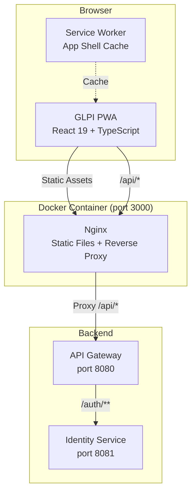
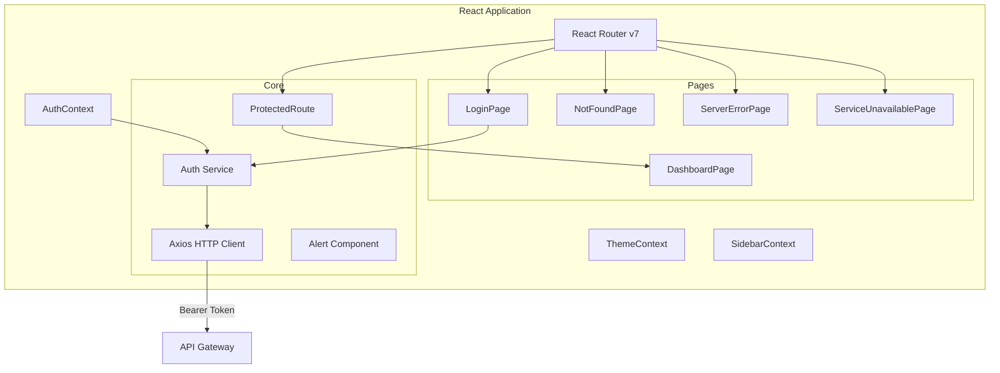
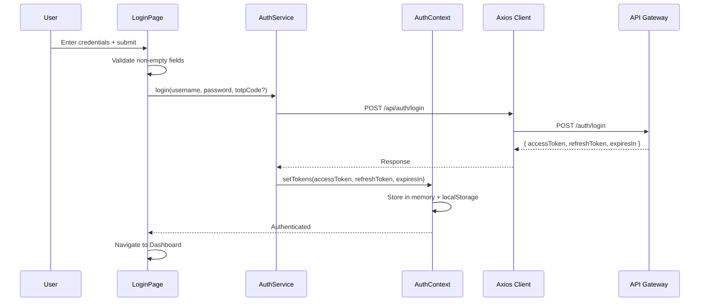
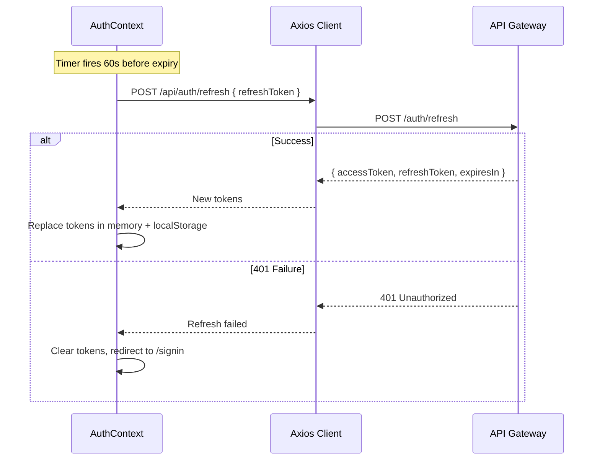

# Design Document — GLPI PWA Frontend

## Overview

This design describes the GLPI PWA Frontend MVP — a Progressive Web App providing authentication (login, token management, logout) and a dashboard landing page for the GLPI microservices backend. The frontend is built with React 19, TypeScript, Tailwind CSS v4, and Vite, adapted from the TailAdmin React v2.1.0 template (`.frontend-template/`, read-only). All source code lives in `frontend/` at the workspace root.

The MVP scope is intentionally narrow: a login page, a dashboard page, error pages (404/500/503), reusable alert components, JWT-based authentication against the API Gateway (port 8080), PWA installability, and Docker deployment via Nginx.

### Key Design Decisions

1. **Copy-and-adapt from template**: The `.frontend-template/` directory is read-only. We copy only the files needed for MVP (auth pages, dashboard layout, error pages, alert components, contexts, common utilities) into `frontend/` and strip everything else (calendar, charts, ecommerce, forms, tables, user profiles, etc.).

2. **Axios for HTTP**: We use Axios as the HTTP client for its interceptor support (automatic token attachment, 401 retry with refresh, centralized error handling). The template has no HTTP client — this is a new dependency.

3. **JWT tokens in memory + localStorage**: Access and refresh tokens are held in memory (React state via AuthContext) for runtime use, and persisted to `localStorage` for session restoration across page reloads. This balances security (no cookies) with UX (session survives refresh).

4. **Vite PWA plugin**: We use `vite-plugin-pwa` to generate the service worker and web app manifest, avoiding manual service worker authoring.

5. **Nginx reverse proxy for `/api/*`**: In production, Nginx proxies `/api/*` requests to the API Gateway, eliminating CORS issues. In development, Vite's proxy achieves the same.

## Architecture

### High-Level Architecture



### Application Architecture



### Request Flow — Login



### Request Flow — Token Refresh



## Components and Interfaces

### Directory Structure

```
frontend/
├── public/
│   ├── favicon.png
│   ├── images/
│   │   ├── logo/                    # App logos (light/dark)
│   │   └── error/                   # 404, 500, 503 SVGs (light/dark)
│   └── icons/                       # PWA icons (192x192, 512x512)
├── src/
│   ├── main.tsx                     # Entry point (ThemeProvider, HelmetProvider, App)
│   ├── App.tsx                      # Router definition
│   ├── context/
│   │   ├── AuthContext.tsx           # Auth state, token management, refresh logic
│   │   ├── ThemeContext.tsx          # Dark/light theme (from template)
│   │   └── SidebarContext.tsx        # Sidebar state (from template)
│   ├── services/
│   │   ├── api.ts                   # Axios instance with interceptors
│   │   └── authService.ts           # login(), refresh(), logout() API calls
│   ├── components/
│   │   ├── auth/
│   │   │   └── SignInForm.tsx        # Login form (adapted from template)
│   │   ├── common/
│   │   │   ├── PageMeta.tsx          # Helmet page meta (from template)
│   │   │   ├── GridShape.tsx         # Decorative grid (from template)
│   │   │   ├── ThemeToggleButton.tsx # Theme toggle (from template)
│   │   │   ├── ThemeTogglerTwo.tsx   # Auth page theme toggle (from template)
│   │   │   └── ScrollToTop.tsx       # Scroll restoration (from template)
│   │   ├── header/
│   │   │   └── UserDropdown.tsx      # User menu with logout (adapted)
│   │   ├── ui/
│   │   │   ├── alert/
│   │   │   │   └── Alert.tsx         # Reusable alert (adapted from template)
│   │   │   └── button/
│   │   │       └── Button.tsx        # Button component (from template)
│   │   └── routes/
│   │       └── ProtectedRoute.tsx    # Auth guard wrapper
│   ├── layout/
│   │   ├── AppLayout.tsx             # Sidebar + header + content (from template)
│   │   ├── AppHeader.tsx             # Top header bar (adapted)
│   │   ├── AppSidebar.tsx            # Sidebar navigation (simplified)
│   │   └── Backdrop.tsx              # Mobile sidebar backdrop (from template)
│   ├── pages/
│   │   ├── AuthPages/
│   │   │   ├── SignIn.tsx            # Login page
│   │   │   └── AuthPageLayout.tsx    # Auth page layout (from template)
│   │   ├── Dashboard/
│   │   │   └── Home.tsx              # Dashboard landing page
│   │   └── ErrorPages/
│   │       ├── NotFound.tsx          # 404 page
│   │       ├── ServerError.tsx       # 500 page
│   │       └── ServiceUnavailable.tsx # 503 page
│   ├── hooks/
│   │   └── useGoBack.ts             # Navigation hook (from template)
│   ├── icons/                       # SVG icon components (subset from template)
│   └── types/
│       └── auth.ts                  # Auth-related TypeScript types
├── index.html                       # HTML entry with PWA meta tags
├── vite.config.ts                   # Vite config with React, SVGR, PWA plugins
├── tsconfig.json
├── tsconfig.app.json
├── tsconfig.node.json
├── tailwind.config.ts
├── postcss.config.js
├── eslint.config.js
├── package.json
├── .env.example
├── Dockerfile                       # Multi-stage: Node build + Nginx
└── nginx.conf                       # Nginx config for SPA + API proxy
```

### Component Interfaces

#### AuthContext (`src/context/AuthContext.tsx`)

```typescript
interface AuthState {
  accessToken: string | null;
  refreshToken: string | null;
  expiresAt: number | null;       // Unix timestamp (ms)
  isAuthenticated: boolean;
  isLoading: boolean;             // True during initial session restore
}

interface AuthContextType extends AuthState {
  login: (username: string, password: string, totpCode?: number) => Promise<void>;
  logout: () => Promise<void>;
  getAccessToken: () => string | null;
}
```

- On mount, reads tokens from `localStorage`. If a valid (non-expired) access token exists, restores the session.
- Schedules a refresh timer that fires 60 seconds before `expiresAt`.
- On refresh failure (401), clears all tokens and sets `isAuthenticated = false`.

#### Auth Service (`src/services/authService.ts`)

```typescript
interface LoginRequest {
  username: string;
  password: string;
  totpCode?: number;
}

interface AuthResponse {
  accessToken: string;
  refreshToken: string;
  expiresIn: number;  // seconds
}

function login(request: LoginRequest): Promise<AuthResponse>;
function refresh(refreshToken: string): Promise<AuthResponse>;
function logout(accessToken: string): Promise<void>;
```

#### Axios HTTP Client (`src/services/api.ts`)

- Base URL: `import.meta.env.VITE_API_GATEWAY_URL || '/api'`
- Request interceptor: attaches `Authorization: Bearer {accessToken}` header when token is available.
- Response interceptor: on 401 for non-auth endpoints, attempts one token refresh + retry. If retry fails, clears session and redirects to `/signin`.

#### ProtectedRoute (`src/components/routes/ProtectedRoute.tsx`)

```typescript
interface ProtectedRouteProps {
  children?: React.ReactNode;
}
```

- Reads `isAuthenticated` and `isLoading` from `AuthContext`.
- While `isLoading` is true, renders a loading spinner.
- If not authenticated, redirects to `/signin`.
- If authenticated, renders `<Outlet />` (or children).

#### Alert Component (`src/components/ui/alert/Alert.tsx`)

```typescript
interface AlertProps {
  variant: 'success' | 'error' | 'warning' | 'info';
  title: string;
  message: string;
  showLink?: boolean;
  linkHref?: string;
  linkText?: string;
}
```

Adapted from the template's Alert component. Adds `role="alert"` ARIA attribute for accessibility. Supports light/dark themes via Tailwind dark classes.

### Routing Table

| Path | Component | Layout | Auth Required |
|---|---|---|---|
| `/signin` | `SignIn` | `AuthPageLayout` | No (redirects to `/` if authenticated) |
| `/` | `Home` (Dashboard) | `AppLayout` | Yes (`ProtectedRoute`) |
| `*` | `NotFound` | Standalone | No |

Error pages (500, 503) are rendered programmatically by the error handling logic, not as routes.

## Data Models

### TypeScript Types (`src/types/auth.ts`)

```typescript
/** Request payload for POST /auth/login */
export interface LoginRequest {
  username: string;
  password: string;
  totpCode?: number;
}

/** Response from POST /auth/login and POST /auth/refresh */
export interface AuthResponse {
  accessToken: string;
  refreshToken: string;
  expiresIn: number;  // seconds until access token expiry
}

/** Refresh request payload for POST /auth/refresh */
export interface RefreshRequest {
  refreshToken: string;
}
```

### Token Storage Schema (localStorage)

| Key | Type | Description |
|---|---|---|
| `glpi_access_token` | `string` | JWT access token |
| `glpi_refresh_token` | `string` | JWT refresh token |
| `glpi_expires_at` | `string` (number) | Unix timestamp (ms) when access token expires |

### PWA Manifest (`manifest.json` — generated by vite-plugin-pwa)

```json
{
  "name": "GLPI",
  "short_name": "GLPI",
  "description": "GLPI IT Service Management",
  "start_url": "/",
  "display": "standalone",
  "background_color": "#ffffff",
  "theme_color": "#1D4ED8",
  "icons": [
    { "src": "/icons/icon-192x192.png", "sizes": "192x192", "type": "image/png" },
    { "src": "/icons/icon-512x512.png", "sizes": "512x512", "type": "image/png" }
  ]
}
```

### Environment Variables

| Variable | Default | Description |
|---|---|---|
| `VITE_API_GATEWAY_URL` | `/api` | API Gateway base URL for HTTP client |
| `VITE_APP_VERSION` | `1.2.0-SNAPSHOT` | Application version string |

### Docker Build Args

| Arg | Maps To | Description |
|---|---|---|
| `API_GATEWAY_URL` | `VITE_API_GATEWAY_URL` | Injected at build time |
| `APP_VERSION` | `VITE_APP_VERSION` | Injected at build time |
| `PUBLIC_URL` | `base` in Vite config | Public URL path prefix |

### Nginx Configuration Highlights

- `location /api/` → `proxy_pass http://api-gateway:8080/`
- `location /` → `try_files $uri $uri/ /index.html` (SPA fallback)
- Hashed assets (`/assets/*`): `Cache-Control: public, max-age=31536000, immutable`
- `index.html`, `sw.js`: `Cache-Control: no-cache, no-store, must-revalidate`


## Correctness Properties

*A property is a characteristic or behavior that should hold true across all valid executions of a system — essentially, a formal statement about what the system should do. Properties serve as the bridge between human-readable specifications and machine-verifiable correctness guarantees.*

### Property 1: Token storage round-trip

*For any* valid token set (accessToken, refreshToken, expiresAt), storing the tokens in Token_Storage and then reading them back should produce values identical to the originals.

**Validates: Requirements 3.4, 4.1, 4.3, 4.6**

### Property 2: Login payload construction

*For any* username string, password string, and optional totpCode number, calling the login service should produce a POST request payload where every provided field matches the input exactly, and the totpCode field is omitted when not provided.

**Validates: Requirements 3.3**

### Property 3: Server error classification

*For any* HTTP status code in the 5xx range (500–599) or a network error, the error classification logic should categorize it as a "server" error type, distinct from authentication (401) or rate-limiting (429) errors.

**Validates: Requirements 3.7**

### Property 4: Form validation rejects whitespace-only input

*For any* string composed entirely of whitespace characters (spaces, tabs, newlines, or empty string), the login form validation should reject it as invalid for both the username and password fields, preventing the API request from being sent.

**Validates: Requirements 3.9**

### Property 5: Refresh timer scheduling

*For any* expiresIn value greater than 60 seconds, the AuthContext should schedule a token refresh at exactly (expiresIn − 60) seconds after token storage, ensuring the refresh fires before the access token expires.

**Validates: Requirements 4.2**

### Property 6: Authorization header formatting

*For any* non-null access token string, the HTTP client request interceptor should produce an `Authorization` header with the value `Bearer {accessToken}` where `{accessToken}` is the exact token string, with no extra whitespace or modification.

**Validates: Requirements 4.5, 8.2**

### Property 7: 401 interceptor retry for non-auth endpoints

*For any* API request URL that does not match `/auth/*`, when the HTTP client receives a 401 response, the interceptor should attempt exactly one token refresh and retry the original request. Auth endpoints (`/auth/login`, `/auth/refresh`, `/auth/logout`) should never trigger the retry logic.

**Validates: Requirements 8.3**

### Property 8: Alert renders arbitrary content

*For any* title string and message string, rendering the Alert component should produce output that contains both the title and message text verbatim, regardless of string content (including special characters, long strings, or unicode).

**Validates: Requirements 11.6**

## Error Handling

### Error Classification

The frontend classifies API errors into categories for consistent user feedback:

| HTTP Status | Category | User Message | Used In |
|---|---|---|---|
| 401 (on `/auth/login`) | `AUTH_INVALID` | "Invalid username or password" | Login page |
| 401 (on other endpoints) | `AUTH_EXPIRED` | Triggers silent refresh + retry | HTTP interceptor |
| 429 | `RATE_LIMITED` | "Too many requests. Please wait and try again." | Login page |
| 500 | `SERVER_ERROR` | Renders 500 error page | Global error boundary |
| 503 / Network error | `SERVICE_UNAVAILABLE` | Renders 503 error page (with retry) | Global error boundary |
| Other 4xx | `CLIENT_ERROR` | "An unexpected error occurred" | Alert component |

### Error Handling Strategy by Layer

1. **Login Page**: Catches errors from `authService.login()` and displays inline Alert components (error variant) based on the error category. Does not navigate away from the login page.

2. **HTTP Client Interceptor**: Handles 401 on non-auth endpoints by attempting one refresh + retry. If retry fails, clears session and redirects to `/signin`. Does not display UI — delegates to the calling component.

3. **AuthContext**: Handles refresh timer failures. On 401 from refresh, clears all tokens and sets `isAuthenticated = false`, which triggers ProtectedRoute to redirect.

4. **Error Pages**: The 500 and 503 pages are rendered when API calls from the Dashboard or future pages encounter server errors. These are full-page replacements (outside AppLayout), with a "Go to Dashboard" or "Retry" action.

5. **Logout**: Always clears tokens regardless of whether the `/auth/logout` API call succeeds or fails. Network errors during logout are silently ignored.

### Error Response Format from API Gateway

```typescript
// The API Gateway returns errors in this format:
interface ApiError {
  status: number;
  message: string;
  timestamp: string;
}
```

The frontend extracts `status` for classification and `message` for optional display in development mode.

## Testing Strategy

### Testing Framework

- **Vitest** as the test runner (Vite-native, fast, compatible with React 19)
- **React Testing Library** for component rendering and interaction tests
- **fast-check** for property-based testing (TypeScript-native PBT library)
- **MSW (Mock Service Worker)** for API mocking in integration tests

### Unit Tests (Example-Based)

Focus on specific scenarios and edge cases:

- Login page renders all required form elements (3.1, 3.2)
- Login page shows error alert on 401 response (3.5)
- Login page shows rate limit alert on 429 response (3.6)
- Login page disables submit button during loading (3.8)
- Logout clears tokens and redirects regardless of API response (5.3)
- ProtectedRoute redirects unauthenticated users to /signin (6.2)
- Authenticated user visiting /signin is redirected to / (6.3)
- 404 page renders with correct elements and theme-aware images (11.1, 11.2)
- 500 page renders with correct elements (11.3)
- 503 page renders with retry action (11.4)
- Alert component renders all four variants with correct styling (11.5)
- Alert component includes role="alert" ARIA attribute (11.10)
- Error pages render outside AppLayout (11.9)

### Property-Based Tests (fast-check)

Each property test runs a minimum of 100 iterations. Each test is tagged with its design property reference.

| Property | Test Description | Tag |
|---|---|---|
| Property 1 | Generate random token sets, store/read round-trip | `Feature: glpi-pwa-frontend, Property 1: Token storage round-trip` |
| Property 2 | Generate random credentials, verify request payload | `Feature: glpi-pwa-frontend, Property 2: Login payload construction` |
| Property 3 | Generate random 5xx codes + network errors, verify classification | `Feature: glpi-pwa-frontend, Property 3: Server error classification` |
| Property 4 | Generate whitespace-only strings, verify validation rejects | `Feature: glpi-pwa-frontend, Property 4: Form validation rejects whitespace` |
| Property 5 | Generate random expiresIn values, verify timer scheduling | `Feature: glpi-pwa-frontend, Property 5: Refresh timer scheduling` |
| Property 6 | Generate random token strings, verify Bearer header format | `Feature: glpi-pwa-frontend, Property 6: Authorization header formatting` |
| Property 7 | Generate random URLs, verify retry logic for non-auth vs auth paths | `Feature: glpi-pwa-frontend, Property 7: 401 interceptor retry` |
| Property 8 | Generate random title/message strings, verify Alert renders them | `Feature: glpi-pwa-frontend, Property 8: Alert renders arbitrary content` |

### Integration Tests

- Docker container builds successfully and serves static files
- Nginx proxies `/api/*` to API Gateway
- Nginx serves `index.html` for SPA routes
- PWA manifest is served correctly
- Service worker registers in browser

### Test Configuration

```typescript
// vitest.config.ts
export default defineConfig({
  test: {
    environment: 'jsdom',
    globals: true,
    setupFiles: ['./src/test/setup.ts'],
  },
});
```

Dependencies to add:
- `vitest` (dev)
- `@testing-library/react` (dev)
- `@testing-library/jest-dom` (dev)
- `@testing-library/user-event` (dev)
- `fast-check` (dev)
- `msw` (dev)
- `jsdom` (dev)
